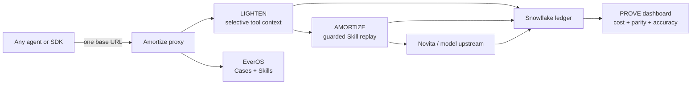

# AMORTIZE — The cost drops. The answer doesn't.

> **AI agents have amnesia. Your cloud bill does not.**
>
> Amortize is a transparent local proxy that makes agent runs cheaper, turns
> repeated work into reusable skills, and proves every saving in Snowflake.

**Snowflake × Beta Fund · Agent & Token Economy Hackathon**

Primary track: **Cost of Intelligence** · Secondary: **Wildcard / agent economics**

## Judge this project in 30 seconds

| The problem | The product | The proof |
|---|---|---|
| Agents repeatedly resend large tool schemas and rediscover procedures they already completed. | Point an existing OpenAI- or Anthropic-compatible client at one local proxy. No SDK swap and no application rewrite. | Every LLM, tool, replay, and parity step lands in a Snowflake-compatible ledger. The demo computes savings from those rows. |

The product has three verbs:

1. **LIGHTEN** new runs by revealing full tool schemas only when the model asks
   for them and spilling oversized tool results behind readable handles.
2. **AMORTIZE** repeat runs by compiling successful Cases into guarded Skills
   and replaying the procedure with at most two small LLM calls.
3. **PROVE** the result with token, cost, latency, parity, and accuracy evidence
   in Snowflake, with SQLite as a resilient local fallback.

The promise is deliberately simple:

> **The cost drops. The answer doesn't.**

## The three-minute experience

```text
00:00  Problem       “AI agents have amnesia. Your cloud bill does not.”
00:25  One switch    Existing agent → Amortize with one base URL
00:45  LIGHTEN       Cold run: fewer schema tokens, same 120 fields
01:25  AMORTIZE      Repeat run: guarded Skill replay, parity ✓
02:00  PROVE         Open Snowflake-backed evidence, not a marketing estimate
02:25  Universality  Reuse the proxy with another agent; optional voice trigger
02:45  Close         “Compound intelligence—not token bills.”
```

Full materials:

- [Legendary three-minute pitch](PITCH_SCRIPT.md)
- [Eight-slide narrative and visual direction](SLIDES.md)
- [Live-demo runbook and failure ladder](DEMO_RUNBOOK.md)
- [Video shot list](VIDEO_PLAN.md)
- [Verified metrics and truth-lock process](METRICS.md)
- [Judge Q&A](JUDGE_QA.md)

## Architecture



Amortize sits in the request path, but optimization is never allowed to break
the request. A failed optimization falls back to the original full agent run.

## One switch, existing clients

```bash
uv sync
uv run amort up
```

OpenAI-compatible clients:

```text
base_url = http://127.0.0.1:4000/v1
```

Anthropic-compatible clients and Claude Code:

```bash
export ANTHROPIC_BASE_URL=http://127.0.0.1:4000
```

Demo and proof:

```bash
uv run amort demo --task ticket_triage --live
uv run amort stats
uv run amort dash --port 8501
```

## What the demo actually proves

The committed fixture asks an agent to triage 30 support tickets using eight
verbose tools. Each of the four measured cells—direct/proxied × cold/warm—is
graded against a deterministic 120-field report.

The latest committed live baseline is intentionally the **pre-optimization
control**:

| Cell | Tokens | Cost | Time |
|---|---:|---:|---:|
| Direct cold | 47,523 | $0.008 | 34.7 s |
| Amortize cold | 46,866 | $0.008 | 30.9 s |
| Direct warm | 48,150 | $0.008 | 35.0 s |
| Amortize warm | 45,491 | $0.008 | 31.2 s |

That run achieved cold parity, warm parity, **120/120 field equality**, and
ground-truth accuracy across all cells. Its ±few-percent delta is normal model
noise while LIGHTEN and AMORTIZE are still being merged; it is not presented as
a saving. See [METRICS.md](METRICS.md) before quoting any final percentage.

Submission gates:

- LIGHTEN: **≥60% tool-schema token reduction** with equal output.
- AMORTIZE: **≥85% cheaper warm run** with field-exact parity.
- Every public number must trace to `demo_report.json` and ledger rows.

## Why this can win

### Track 1 · Cost of Intelligence

The demo compares the same task, model, tools, output contract, and grader. The
only variable is whether traffic flows through Amortize. The percentage on the
screen is calculated—not asserted.

### Wildcard · Agent and token economics

Snowflake turns opaque model traffic into an auditable economic layer: cost per
agent, task, step, tool, replay, team, and model. That creates a path to budgets,
chargeback, routing, and reusable Skill marketplaces.

### Product path

The local proxy is the open-source wedge. A hosted team product can add policy,
shared verified Skills, spend budgets, chargeback, and fleet analytics. A
possible—not yet launched—pricing hypothesis is a free local tier plus a
per-seat team control plane, comfortably above the track's $10 ARR/user bar.

## The wow moments

1. **One-line adoption:** change a base URL, not the agent.
2. **A fair race:** direct versus Amortize, cold versus repeated.
3. **The parity stamp:** savings do not count unless the 120 fields match.
4. **The Snowflake receipt:** judges can inspect the rows behind the percentage.
5. **The second-client beat:** route Claude Code, Cursor, or another compatible
   agent through the same proxy. Voice can trigger the task, but the ledger is
   the proof.

## Demo routes

| Surface | Route |
|---|---|
| Proxy | `http://127.0.0.1:4000` |
| OpenAI chat completions | `POST /v1/chat/completions` |
| Anthropic messages | `POST /v1/messages` |
| Health | `GET /health` |
| Proxy statistics | `GET /stats` |
| Streamlit dashboard | `http://localhost:8501` |
| Projector stage | Planned `http://localhost:4700`; use only after merged and verified |

## Showcase design pattern

The submission borrows presentation patterns—not code or assets—from three
high-signal open-source projects:

- [Browser Use](https://github.com/browser-use/browser-use): lead with visual,
  named tasks and an immediate human/agent quickstart.
- [Langflow](https://github.com/langflow-ai/langflow): communicate the product
  in one feature block and get to a runnable command quickly.
- [OpenHands](https://github.com/OpenHands/OpenHands): show a clear product
  ladder from local developer tool to a team/cloud business.

Our differentiator is the **proof surface**: the first hero visual should be the
measured race plus parity, not a generic agent animation.

## Submission asset checklist

- [ ] 16:9 title slide and eight-slide deck
- [ ] 60–90 second captioned product cut
- [ ] Three-minute offline backup video
- [ ] Clean live `demo_report.json` from the final commit
- [ ] Results screenshot with visible parity and backend label
- [ ] Snowflake query/result screenshot
- [ ] Architecture graphic exported from the Mermaid diagram
- [ ] QR code to repository and 60-second video
- [ ] Final README links—no private or expiring URLs
- [ ] Credentials, usernames, and tokens cropped from every frame

## Source of truth

- Product and local setup: [`../README.md`](../README.md)
- Current ownership: [`../TEAM.md`](../TEAM.md)
- Frozen interfaces: [`../CONTRACTS.md`](../CONTRACTS.md)
- Measured engineering log: [`../BUILD_REPORT.md`](../BUILD_REPORT.md)
- Executable claims: `../scripts/accept_layer1.py` and
  `../scripts/accept_layer2.py`
