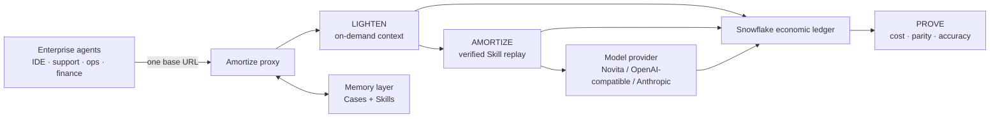

# AMORTIZE

## The cost-control plane for enterprise AI agents

> **Every agent run should get cheaper with experience.**

Enterprises are deploying agents into support, engineering, finance, and
operations. But every run still pays to resend large tool definitions,
reprocess large results, and rediscover workflows the company already paid to
solve.

Amortize sits between any compatible agent and its model. It removes avoidable
context, converts successful repeated work into verified Skills, and writes the
economic proof to Snowflake.

```text
One base URL. Same agent. Same answer. Lower measured cost.
```

**Snowflake × Beta Fund · Agent & Token Economy Hackathon**

Primary track: **Cost of Intelligence** · Secondary: **Wildcard**

## The YC answer

**What are you building?**

A transparent proxy that reduces and audits the cost of enterprise AI agents.

**Who needs it?**

AI platform teams operating repetitive, tool-heavy agent workflows.

**What is the wedge?**

Change one model base URL. No application rewrite or agent-framework lock-in.

**Why does it win?**

Amortize optimizes both new and repeated runs, then refuses to count a saving
unless output parity passes.

## The enterprise problem: three taxes

### 1. The context tax

An agent may carry dozens of verbose tool schemas even when a turn needs only
one. Those tokens are billed repeatedly across the agent loop.

### 2. The repetition tax

A workflow that succeeded yesterday is usually rediscovered from scratch today.
The company pays for reasoning it already owns.

### 3. The accountability gap

Provider invoices show total usage, not which agent, task, internal discovery
step, replay, or tool created the bill—and not whether the cheaper output was
still correct.

## One product, three verbs

| Layer | What it does | Enterprise outcome |
|---|---|---|
| **LIGHTEN** | Discovers tools on demand and spills oversized results behind readable handles | Less context and lower cost on new tasks |
| **AMORTIZE** | Compiles agreeing successful Cases into guarded, versioned Skills | Repeated workflows become cheaper and faster |
| **PROVE** | Records model calls, tools, replays, tokens, cost, accuracy, and parity | Auditable savings, budgets, and chargeback data |

The operating principle:

> **The cost drops. The answer doesn't.**

## The 100-second product demo

1. Route an unchanged agent through `http://127.0.0.1:4000/v1`.
2. Prove the proxy is live with a fast health check.
3. Reveal the truth-locked 30-ticket, eight-tool cold result.
4. Reveal the repeated-task Skill result and exact parity.
5. Query the Snowflake rows behind both percentages.

```bash
uv run amort up
# Run the full measured 2×2 immediately before presenting:
uv run amort demo --task ticket_triage --live
uv run amort stats
uv run amort dash --port 8501
```

Presenter assets:

- [Three-minute demo pitch](PITCH_SCRIPT.md)
- [Three-minute cue card](THREE_MINUTE_CUE_CARD.md)
- [Exact live demo script](DEMO_SCRIPT.md)
- [Prewritten Snowflake demo queries](DEMO_QUERIES.sql)
- [YC pitch variants](YC_PITCH.md)
- [Six-slide deck](SLIDES.md)
- [Enterprise one-pager](ENTERPRISE_ONE_PAGER.md)
- [Hackathon submission copy](SUBMISSION_COPY.md)
- [Demo operations runbook](DEMO_RUNBOOK.md)
- [Video plan](VIDEO_PLAN.md)
- [Verified metrics lock](METRICS.md)
- [Judge Q&A](JUDGE_QA.md)
- [Positioning notes](POSITIONING.md)

## The fair race

```text
                     DIRECT                    AMORTIZE
NEW TASK             full agent                LIGHTEN
REPEATED TASK        full agent again          verified Skill replay

Constant: model · task · tools · output contract · 120-field grader
```

Submission gates—not achieved claims until the final evidence run:

- **≥60% tool-schema token reduction** with equal output.
- **≥85% cheaper warm run** with field-exact parity.
- Every public percentage traces to `demo_report.json` and ledger rows.

## Current verified control

The latest committed live Novita run established a clean pre-optimization
control:

| Cell | Tokens | Cost | Time |
|---|---:|---:|---:|
| Direct cold | 47,523 | $0.008 | 34.7 s |
| Amortize cold | 46,866 | $0.008 | 30.9 s |
| Direct warm | 48,150 | $0.008 | 35.0 s |
| Amortize warm | 45,491 | $0.008 | 31.2 s |

The run achieved 120-field cold parity, 120-field warm parity, and correct
ground truth in all four cells. Its small cost delta is ordinary run-to-run
noise while the optimizer layers are pending merge. It is not a savings claim.

See [METRICS.md](METRICS.md) before quoting final results.

## Architecture



Optimization is fail-open. Unsupported request shapes pass through untouched;
an optimizer failure retries the original full request.

## Not another model gateway or memory database

| Category | Primary job | What remains missing |
|---|---|---|
| Model gateway | Route requests across providers | Does not make repeated procedures reusable |
| Prompt cache | Discount repeated provider prefixes | Depends on prefix/provider behavior; does not replay work as code |
| RAG / agent memory | Retrieve prior facts and context | More context can still increase inference cost |
| **Amortize** | Make run economics improve with experience | Uses memory and routing as inputs, then proves cost and parity |

Agent-memory platforms correctly argue that experience should become reusable
assets. Amortize applies that principle to enterprise unit economics: a Skill is
valuable only when it measurably avoids work and still passes parity.

## The enterprise buyer

**Primary user:** AI platform engineer.

**Economic buyer:** VP Engineering, Head of AI Platform, or FinOps leader.

**First workflows:** support triage, incident response, code maintenance,
invoice reconciliation, compliance checklists, and recurring research.

What they buy:

- lower cost per successful agent task;
- auditable cost by run, task, model, and step;
- safe reuse with versioning, guards, and fallback;
- a path to budgets, policy, and internal chargeback;
- portability across compatible clients and model providers.

## Business model hypothesis

The local proxy is the open-source wedge. A paid enterprise control plane can
add shared Skill governance, SSO/RBAC, fleet policy, budgets, chargeback,
retention controls, and managed Snowflake reporting.

This is product direction, not shipped functionality or claimed revenue.

## Demo routes

| Surface | Route |
|---|---|
| Proxy | `http://127.0.0.1:4000` |
| OpenAI chat completions | `POST /v1/chat/completions` |
| Anthropic messages | `POST /v1/messages` |
| Health | `GET /health` |
| Proxy statistics | `GET /stats` |
| Dashboard | `http://localhost:8501` |
| Stage | Planned `http://localhost:4700`; use only after verified |

## Source of truth

- Product and setup: [`../README.md`](../README.md)
- Ownership: [`../TEAM.md`](../TEAM.md)
- Frozen interfaces: [`../CONTRACTS.md`](../CONTRACTS.md)
- Measured build log: [`../BUILD_REPORT.md`](../BUILD_REPORT.md)
- Executable claims: `../scripts/accept_layer1.py` and
  `../scripts/accept_layer2.py`

Positioning inspiration: [TencentDB Agent Memory](https://github.com/TencentCloud/TencentDB-Agent-Memory)
demonstrates how to explain reusable agent experience as enterprise
infrastructure. Amortize occupies a different layer: measured cost reduction,
guarded procedural reuse, and economic proof.
