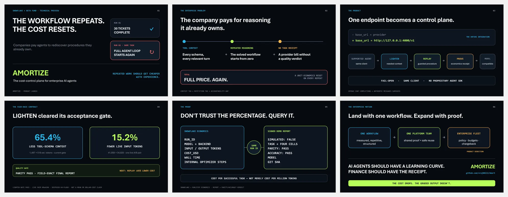
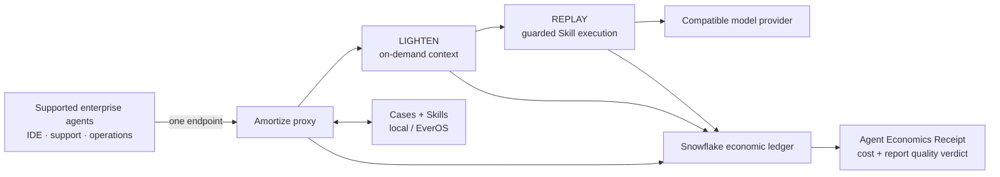

# Introducing Amortize

## The cost-control plane for enterprise AI agents

> **Repeated agent work should get cheaper with experience.**

**Route once. LIGHTEN new work. REPLAY verified repeats. PROVE every claim.**

[Watch the 75-second cut](VIDEO_PLAN.md) · [Run the fair race](DEMO_RUNBOOK.md) ·
[Deliver the three-minute pitch](PITCH_SCRIPT.md) ·
[Open the launch deck](AMORTIZE_LAUNCH_DECK.pptx)

**Technical preview · Snowflake × Beta Fund Agent & Token Economy Hackathon**

Primary track: **Cost of Intelligence** · Secondary: **Wildcard**



```text
65.4% LESS TOOL-SCHEMA CONTEXT  ·  15.2% FEWER LIVE INPUT TOKENS  ·  PARITY PASS
```

The current checkout's unit gate measures 1,497 → 518 estimated schema tokens
(−65.4%). The live A/B pair in `BUILD_REPORT.md` at `09e4396` measures 41,058 →
34,820 input tokens (−15.2%) with field-exact parity. The live result is a
single pair—not a mean and not yet an end-to-end dollar-savings claim.

Companies are deploying fleets of AI agents, but their unit economics reset on
every run. The same tool manuals return to context. The same solved procedure
is reasoned through again. And the provider bill cannot tell finance whether a
cheaper run still completed the job.

Amortize sits between a supported agent client and its model. One endpoint
change creates a place to reduce avoidable context, reuse guarded procedures,
and measure cost per successful task.

```text
One endpoint. Same graded output. Measured economics.
```

## What launches today

**Product:** a self-hosted, OpenAI- and Anthropic-compatible proxy with a
four-cell comparison harness, a live projector stage, and an economic ledger.

**User:** the AI platform engineer operating repetitive, tool-heavy workflows.

**Buyer:** the Head of AI, VP Engineering, or FinOps owner accountable for the
model bill.

**Wedge:** change one base URL. No proprietary agent SDK and no application
rewrite.

**Expansion:** shared verified Skills, policy, budgets, chargeback, retention,
and fleet analytics. These are product direction, not shipped claims.

## The launch artifact: the Agent Economics Receipt

Every measured comparison resolves to a receipt: what ran, what the model and
tools consumed, what it cost, which backend stored the economics, and whether
the structured output contract passed.

```text
RUN       direct vs Amortize · cold vs repeat
ECONOMY   model · tokens · dollars · wall time · internal optimizer usage
QUALITY   parity · ground-truth accuracy · simulated flag
PROOF     run IDs · ledger backend · demo report · git SHA
```

Today, Snowflake records run and step economics. `demo_report.json` records the
parity and ground-truth verdict for the full race. The final demo shows both
artifacts together; it does not imply the quality verdict is already persisted
as a Snowflake grade row.

## Before and after

| Without Amortize | With the Amortize control plane |
|---|---|
| Every tool definition rides every relevant turn | LIGHTEN reveals tool schemas on demand and preserves needed history |
| A repeated workflow starts another full agent loop | REPLAY is designed to execute a verified Skill behind guards |
| A provider invoice ends the conversation | The receipt connects cost to task, run, step, and graded outcome |
| A cheaper wrong answer can look like a win | The saving is rejected when parity or accuracy fails |

## One switch

Start the proxy:

```bash
uv run amort up
```

Point a supported client at it:

```bash
# Anthropic-compatible clients, including the tested Claude Code gateway path
export ANTHROPIC_BASE_URL=http://127.0.0.1:4000

# OpenAI-compatible clients
base_url=http://127.0.0.1:4000/v1
```

That config diff is the first product reveal in the pitch: same client, same
model interface, one new control point.

## One product, three layers

| Layer | Product contract | Current branch truth |
|---|---|---|
| **LIGHTEN** | Discover tools on demand and spill oversized results behind readable handles | **Merged; acceptance green.** 65.4% less schema context in the current unit gate and 15.2% fewer live input tokens in the recorded pair, with field-exact parity |
| **REPLAY** | Compile agreeing successful Cases into guarded, versioned Skills | Recorder/store exist; compiler and replayer remain stubs until their gate passes |
| **PROVE** | Measure model calls, tools, tokens, cost, latency, backend, and race outcomes | Proxy ledger, four-cell harness, signed report, dashboard, and stage are implemented |

The rule is simple:

> **The cost drops. The graded output doesn't.**

## The signature demo: a fair race

```text
                         DIRECT                  AMORTIZE
NEW TASK                 full agent              LIGHTEN path
REPEATED TASK            full agent again        guarded Skill path

Held constant: model · 30 tickets · 8 tools · task prompt · 120-field grader
```

Run the full race immediately before presenting; it takes roughly two minutes
and does not fit inside the three-minute talk.

```bash
# Terminal A — leave running
uv run amort up

# Terminal B — truth-locked comparison plus projector stage
uv run amort demo --task ticket_triage --live --stage

# Optional evidence surfaces
uv run amort stats
uv run amort dash --port 8501
```

The stage is real and available at `http://127.0.0.1:4700`. A recorded report
can drive the same stage without the network:

```bash
uv run amort demo --replay demo_report.json --stage-port 4700
```

## Acceptance contract

LIGHTEN's technical gate is now green. The remaining launch contract is:

- preserve the verified **65.4% tool-schema reduction** and field-exact parity
  on the final presentation SHA;
- **≥85% lower repeat cost** with field-exact parity;
- **120/120 fields identical and 120/120 correct**;
- `simulated: false`, final model visible, backend visible;
- every internal discovery, compilation, binding, and verification model call
  included in total usage;
- the exact commit, report, screenshot, video, and spoken numbers agree.

## Current verified LIGHTEN result

Workstream A is merged on main and its acceptance evidence is recorded in
`BUILD_REPORT.md`:

| Proof | Direct / off | LIGHTEN / on | Measured delta |
|---|---:|---:|---:|
| Eight-tool schema estimate, stub text included | 1,497 | 518 | **−65.4%** |
| Live end-to-end input tokens | 41,058 | 34,820 | **−15.2%** |
| Final structured report | reference | field-exact equal | **parity pass** |

The live figure is one measured pair on a model with observed trajectory
variance. It is strong launch evidence, but the final demo should still show
raw values, the final SHA, and the repeat-cost result separately.

## Current verified control—not a savings claim

The last committed live control (`f4fca99`, 2026-08-07) established a stable
comparison before the optimizer layers land:

| Cell | Tokens | Cost | Time |
|---|---:|---:|---:|
| Direct cold | 47,523 | $0.008 | 34.7 s |
| Amortize cold | 46,866 | $0.008 | 30.9 s |
| Direct repeat | 48,150 | $0.008 | 35.0 s |
| Amortize repeat | 45,491 | $0.008 | 31.2 s |

All four cells passed ground-truth accuracy. Cold and repeat outputs each
matched across 120 graded fields. The small cost differences are ordinary
run-to-run noise and are deliberately not presented as savings.

See [METRICS.md](METRICS.md) before moving any number into a slide, caption, or
spoken line.

## Architecture



Optimization is fail-open: unsupported shapes pass through, and a failed
optimization must retry the original full path. A cheap wrong answer is a
failed run, not a saving.

## Compatibility and boundaries

| Surface | Demonstrated contract | Optimization status |
|---|---|---|
| Anthropic Messages | streaming and non-streaming proxy; Claude Code gateway path tested | pass-through today; optimization gate pending |
| OpenAI Chat Completions | proxy plus live Novita demo harness | pass-through today; optimization gate pending |
| Stage view | browser at `http://127.0.0.1:4700`, SSE events, report replay | shipped |
| Dashboard | Streamlit at `http://127.0.0.1:8501` | shipped |
| Ledger | Snowflake with SQLite failover | shipped for run/step economics |

The initial safe-reuse wedge is deterministic, structured, read-heavy work:
support triage, incident classification, reconciliation, compliance
checklists, and recurring research. Side-effecting or money-moving workflows
require idempotency, approvals, and action policy before replay.

This hackathon build is a localhost/self-hosted technical preview. Cases may
contain prompts, tool arguments/results, and final outputs in local Markdown or
EverOS. Production direction includes redaction, retention policy, encryption,
tenant isolation, SSO/RBAC, VPC deployment, and approval controls.

## Enterprise land and expand

**Land:** route one repetitive, measurable workflow through Amortize.

**Prove:** run direct and optimized paths under the same model, tools, task, and
grader. Count every internal call and calculate cost per successful task.

**Expand:** once economics are visible in Snowflake, apply shared Skills,
budgets, policy, and chargeback across the agent fleet.

```text
one workflow  →  one platform team  →  enterprise agent fleet
```

Design-partner call to action:

> Run more than 100,000 tool-using agent tasks a month? Bring us one repeated
> workflow. We will return a measured cost-per-success report and its evidence.

## Why this can win the hackathon

- It attacks the track's exact unit of value: the cost of a successful agent
  task, not just token price.
- LIGHTEN already clears its schema-context gate at 65.4%, with a live pair
  showing 15.2% fewer input tokens and field-exact parity.
- It demonstrates a percentage only after a controlled direct-versus-Amortize
  race and a structured quality contract.
- Snowflake is part of the product: it connects engineering telemetry to
  finance, governance, budgets, and future chargeback.
- The open-source proxy gives the product a low-friction enterprise wedge.
- The long-term asset is customer-specific knowledge of which guarded
  procedure works, what it saves, and when it must fall back.

The concept is win-worthy. The remaining technical requirement is guarded
REPLAY: it must pass the repeat-cost and quality gate, after which the launch
assets must be refreshed from that exact evidence run.

## Demo routes

| Surface | Route |
|---|---|
| Proxy | `http://127.0.0.1:4000` |
| OpenAI chat completions | `POST /v1/chat/completions` |
| Anthropic messages | `POST /v1/messages` |
| Health | `GET /health` |
| Proxy statistics | `GET /stats` |
| Projector stage | `http://127.0.0.1:4700` |
| Stage event stream | `GET http://127.0.0.1:4700/events` |
| Dashboard | `http://127.0.0.1:8501` |

## Presenter kit

- [Launch PowerPoint](AMORTIZE_LAUNCH_DECK.pptx)
- [Launch deck source and slide-by-slide direction](SLIDES.md)
- [Three-minute pitch](PITCH_SCRIPT.md)
- [One-page cue card](THREE_MINUTE_CUE_CARD.md)
- [Exact demo sequence](DEMO_SCRIPT.md)
- [Operator runbook](DEMO_RUNBOOK.md)
- [75-second video storyboard](VIDEO_PLAN.md)
- [Ready-to-import 75-second caption track](amortize-product-75s-current.srt)
- [Voice cursor integration plan](VOICE_CURSOR_INTEGRATION.md)
- [Current repo status and work remaining](REPO_STATUS.md)
- [Snowflake proof queries](DEMO_QUERIES.sql)
- [Verified metrics lock](METRICS.md)
- [Enterprise one-pager](ENTERPRISE_ONE_PAGER.md)
- [Judge Q&A](JUDGE_QA.md)
- [Submission form copy](SUBMISSION_COPY.md)
- [Positioning and competitive frame](POSITIONING.md)

## Branch and ownership

- **Submission branch:** `sameer`
- **Implementation source:** `origin/main` (merged into `sameer` before this
  launch pass)
- **Submission owner:** Sameer Nagar / `sameernagar-hub`
- **Code ownership:** implementation workstreams in [TEAM.md](../TEAM.md)
- **Rule while main moves:** merge `origin/main`, rerun the gates, then refresh
  every screenshot, metric, SHA, deck, and spoken line together.

## Sources of truth

- Product/setup: [root README](../README.md)
- Ownership: [TEAM.md](../TEAM.md)
- Frozen interfaces: [CONTRACTS.md](../CONTRACTS.md)
- Measured build log: [BUILD_REPORT.md](../BUILD_REPORT.md)
- Executable gates: `../scripts/accept_layer1.py` and
  `../scripts/accept_layer2.py`

Positioning inspiration: [TencentDB Agent Memory](https://github.com/TencentCloud/TencentDB-Agent-Memory)
demonstrates how to package reusable agent experience as an understandable
enterprise asset. Amortize occupies a different layer: guarded procedural
reuse tied to measured task economics.
